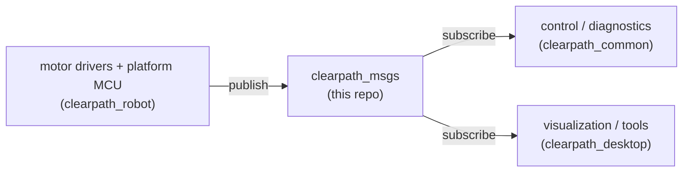

# clearpath_msgs

Shared ROS 2 **interface definitions** (messages, services, and actions) used across the Clearpath
stack. These packages contain only interface files — no runtime nodes — so every other repository
can depend on them without pulling in extra logic.

For supported platforms, sensors, and manipulators plus additional details, please see:
<https://docs.clearpathrobotics.com/docs/ros/>

## Where this fits in the Clearpath ROS 2 stack

These interfaces are the **contract** between the firmware/hardware drivers in `clearpath_robot`,
the control layer in `clearpath_common`, and any offboard consumers in `clearpath_desktop`.
Producers (motor drivers, platform MCU) publish these types; consumers (control, diagnostics,
visualization) subscribe to them.



## Packages

| Package | Description | Interfaces |
|---|---|---|
| `clearpath_msgs` | Metapackage aggregating the message packages. | — |
| `clearpath_platform_msgs` | Base platform telemetry and commands (power, lights, fans, drive, stop status, MCU config). | `msg/` (e.g. `Power`, `Status`, `Lights`, `Drive`, `Feedback`, `StopStatus`), `srv/` (`ConfigureMcu`, `SetPinout`) |
| `clearpath_motor_msgs` | Motor controller feedback/status for Lynx (current) and Puma (legacy) drivers. | `msg/` (e.g. `LynxFeedback`, `LynxStatus`, `PumaFeedback`), `action/` (`LynxCalibrate`, `LynxUpdate`) |
| `clearpath_control_msgs` | Higher-level control interface messages. | `msg/StreamControl`, `srv/PowerControl` |

## Build

Interface packages are built with `colcon` like any other ROS 2 package:

```bash
rosdep install --from-paths src --ignore-src -r -y
colcon build --symlink-install
source install/setup.bash
```

## Notes

- Changing an existing `.msg`/`.srv`/`.action` is an **ABI/API break**: rebuild every package that
  depends on it (drivers, control, desktop tools) or you will hit type-hash mismatches at runtime.
- Keep new interfaces in the package that matches their layer (platform vs motor vs control) so
  dependency direction stays one-way.

## Documentation

- [ROS 2 API overview](https://docs.clearpathrobotics.com/docs/ros/api/overview) — the topics, services, and actions built on these interfaces.

## License

BSD. See [LICENSE](LICENSE).
